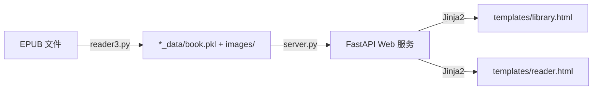

# CLAUDE.md

This file provides guidance to Claude Code (claude.ai/code) when working with code in this repository.

## Project Overview

Reader3 is a lightweight, self-hosted EPUB reader web app. It processes EPUB files into pickled Python objects, then serves them via a FastAPI web interface for chapter-by-chapter reading. Designed for copying chapter text to LLMs.

## Commands

```bash
# 处理 EPUB 文件（生成 *_data/ 目录）
uv run reader3.py <file.epub>

# 启动 Web 服务器（默认 http://127.0.0.1:8123）
uv run server.py

# 安装依赖
uv sync
```

无测试、无 lint、无构建步骤。

## Architecture



### 核心数据流

1. **EPUB 处理** (`reader3.py`): 读取 EPUB → 提取元数据/TOC/内容/图片 → 序列化为 `book.pkl`
2. **Web 服务** (`server.py`): 扫描 `*_data` 文件夹 → `lru_cache` 加载 pickle → 路由渲染模板

### 数据模型 (`reader3.py`)

- `Book` → 顶层对象，包含 metadata / spine / toc / images
- `ChapterContent` → Spine 中的物理文件，含 cleaned HTML 和纯文本
- `TOCEntry` → 导航树节点，支持嵌套 children
- `BookMetadata` → 标题/作者/语言等元数据

### 前端特点

- 纯服务端渲染（Jinja2），无前端构建
- `reader.html` 内联全部 CSS/JS，包含浮动复制按钮和提示词模板系统
- 模板数据存储在浏览器 localStorage
- TOC 侧边栏通过 JS `spineMap` 映射文件名到 spine 索引

### 图片路径

EPUB 中的图片路径在处理时被重写为 `images/<filename>`，服务器通过 `/read/{book_id}/images/{image_name}` 路由提供图片服务。

## Dependencies

Python ≥3.10, beautifulsoup4, ebooklib, fastapi, jinja2, uvicorn
