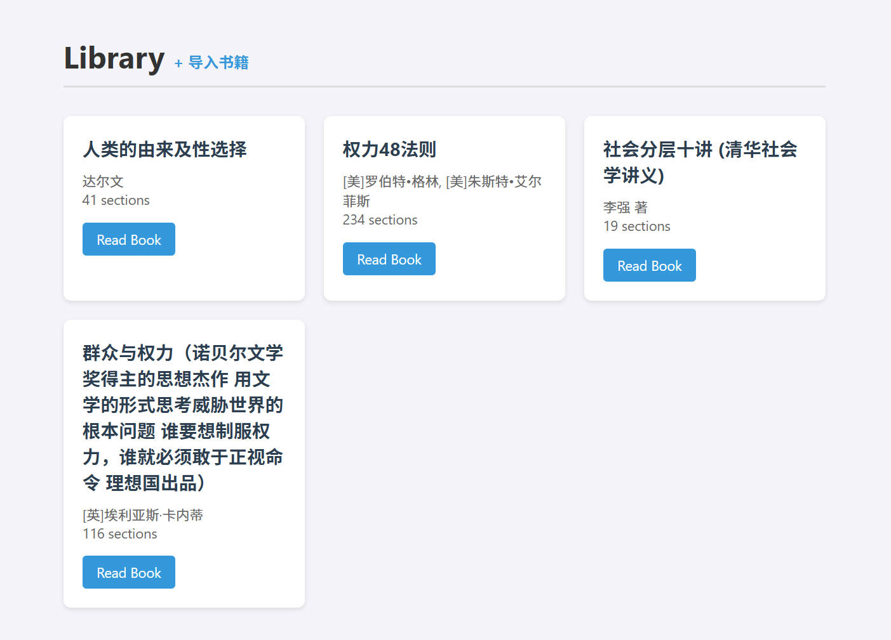

# BookLens

自托管 EPUB 阅读器，提供书架、正文阅读、全书搜索和基于原文的 AI 问书。



## 当前能力

- 导入并解析 EPUB，展示书籍元数据、封面和目录。
- 单页正文阅读；目录固定为左侧栏，AI 问书固定为可拖动宽度的右侧栏。
- 搜索章节标题和正文，结果可跳转并定位关键词。
- 记忆每本书的章节与滚动位置；保存字号、字体和深浅色设置。
- AI 范围支持当前章节、指定章节（最多 12 节）或全书检索。
- 阅读分析提示词可在 AI 设置中修改；服务端安全约束不可被覆盖。
- DeepSeek 回答以 SSE 增量输出；推理过程不展示，API Key 不下发浏览器。

当前刻意不提供阅读笔记、划线和双页显示，避免维护未完成的交互分支。

## 本地启动

需要 Python 3.10+ 和 [uv](https://docs.astral.sh/uv/)。

```bash
cp .env.example .env
# 编辑 .env，设置 DEEPSEEK_API_KEY
uv sync
uv run server.py
```

打开 [http://localhost:8123](http://localhost:8123)，在书架页面导入 EPUB。

也可用 Docker Compose：

```bash
docker compose up --build -d
```

## 验证

```bash
uv run pytest -q
```

## 文档

- [架构与数据流](docs/architecture.md)
- [集成与 API](docs/integration-guide.md)
- [部署与故障处理](docs/operator-runbook.md)
- [维护交接](docs/handoff.md)
- [设计回归记录](design-qa.md)

## 安全边界

- 真实密钥只放在被 Git 忽略的 `.env` 或服务器环境变量中。
- `book/` 保存导入后的书籍数据，不应提交到 Git。
- 生产环境由 Cloudflare Access 保护；应用本身不实现用户账号体系。

## License

MIT
